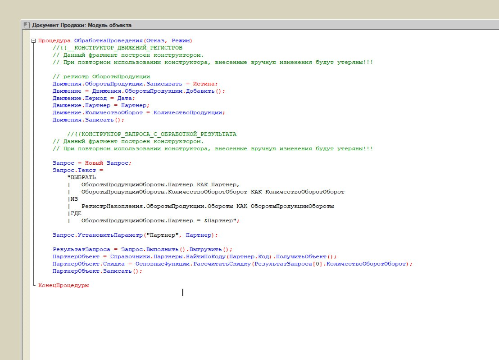
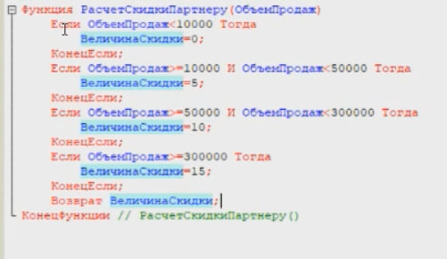
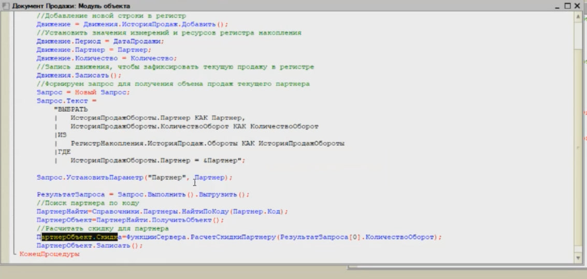
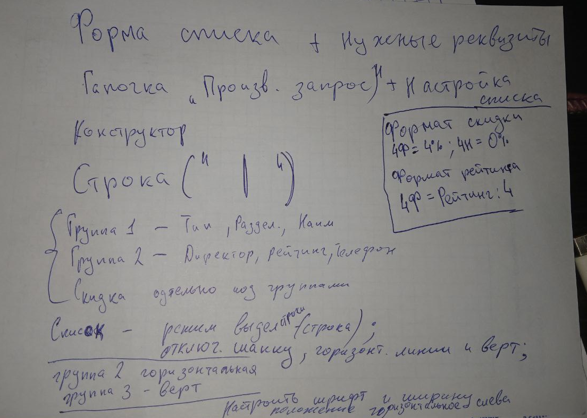

# Регистры накопления — документация

Регистры накопления используются для хранения и анализа данных, представляющих собой накапливаемые значения (например: количество, стоимость, опыт, ресурсы и т.п.). Они позволяют учитывать изменения за определённый период и рассчитывать актуальные остатки или обороты.

## 🔧 Типы регистров

- **Остатки (`Balance`)** — хранят итоговые значения на конкретный момент времени.
- **Обороты (`Turnover`)** — хранят движения за период (приход/расход).

> Регистры могут быть с периодическим или непериодическим режимом хранения.

---

## 🧱 Структура регистра

Каждый регистр накопления включает:

| Элемент        | Назначение                                          |
|----------------|-----------------------------------------------------|
| `Измерения`    | Ключевые аналитики, по которым ведётся учёт         |
| `Ресурсы`      | Накапливаемые числовые значения (сумма, количество) |
| `Реквизиты`    | Дополнительные поля (например, комментарий)         |
| `Период`       | Временная метка записи                              |
| `Регистратор`  | Документ или событие, породившее запись             |

---

## Скриншоты




## 📌 Пример

### Определение регистра ОпытПерсонажей

```yaml
Регистр: ОпытПерсонажей
Тип: Остатки
Измерения:
  - Персонаж (СправочникСсылка.Персонажи)
  - Уровень (Число)
Ресурсы:
  - Опыт (Число)
  - Навыки (Число)
Реквизиты:
  - Комментарий (Строка)
```

## Скриншоты - Пособие





## Заметки по применению дизайнерских решений


